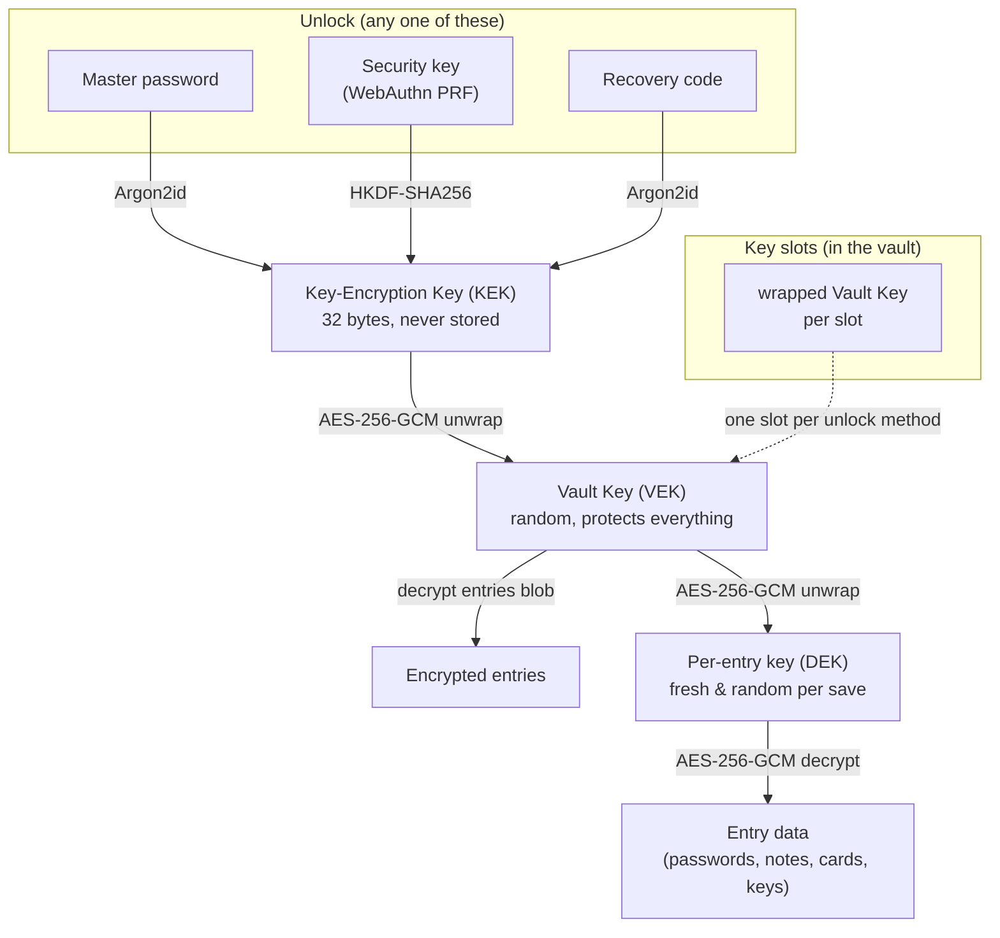

# Bramble

[](https://matrix.to/#/%23general:bramble.sh)
[](https://bramble.sh/latest/android)
[](https://bramble.sh/latest/android)
[](https://bramble.sh/latest/desktop)
[](https://bramble.sh/latest/desktop)
[](https://bramble.sh/latest/desktop)
[](#whats-coming-next)

A password manager that keeps your secrets on your own devices. No account, no server holding your vault, no company to get breached and leak everything. You hold the vault, you hold the password, and that's it.

Bramble runs where you do:

- **Browser extension** for Chromium browsers (Brave, Vivaldi, Chrome, Arc, and friends). Install it and you're up and running in a minute.
- **Desktop app** for macOS and Linux, with a global quick-access panel, an always-on sync hub, and scheduled backups.
- **iOS app** with system AutoFill, Face ID / Touch ID unlock, and passkeys.
- **Android app** with a native autofill service, biometric unlock, and passkeys.

The same encrypted vault and the same Rust crypto core sit behind all four, and your devices can sync to each other directly, peer-to-peer, with no cloud in the middle.

**Get Bramble:**

- Chromium: [Chrome Web Store](https://chromewebstore.google.com/detail/bramble/kmokhdhoggbdcgoepifeckhgbfakaknm)
- Firefox: [Firefox Add-ons Store](https://addons.mozilla.org/firefox/addon/bramble/)
- Desktop (macOS, Linux): [bramble.sh](https://bramble.sh)
- Android: [Releases](https://github.com/flythenimbus/bramble/releases)
- iOS: [App Store](https://apps.apple.com/us/app/bramble-password-manager/id6783071787)

## Screenshots

| <br>**Your vault** | <br>**Pick a vault** | <br>**Autofill on a page** |
|:--:|:--:|:--:|
| <br>**Save a new login** | <br>**Update an existing login** | <br>**Editing an entry** |
| <br>**Create a passkey** | <br>**Sign in with a passkey** | <br>**Settings** |
| <br>**Unlock methods** | <br>**Backups and import** | <br>**Scheduled cloud backups** |
| <br>**Device sync** |

## What it does

Your passwords are encrypted on your own device and stay there: in the browser's private extension storage, in ordinary files on your own disk in the desktop app, and in app-private encrypted storage on mobile. There's no server holding your vault and no account to sign up for. To use the same vault on more than one device, Bramble syncs it **directly between your devices, peer-to-peer**, end-to-end encrypted, with no cloud in the middle. Want a copy in your own hands? Export an encrypted backup file any time.

Everything cryptographic happens inside a single Rust core: compiled to WebAssembly in the browser, and to a native library on iOS and Android. Key derivation, encryption, and decryption all run in that core, and derived keys are wiped from memory after use.

## Backups

Nobody else holds a copy of your vault, so keeping a backup is up to you. Bramble gives you two ways to do it:

- **Explicit: export a backup file.** From Settings in the browser extension or the desktop app, export your whole vault to an encrypted `.bramble` file and stash it somewhere safe: another drive, a USB stick, wherever you like. It stays ciphertext, so opening it still needs your master password and a stolen backup is useless on its own. Do this now and then, especially before any big change.
- **Implicit: peer-to-peer sync.** Turn on sync and every device in your sync group is basically a live copy of the vault. Pair a second device and each one holds everything, so if you lose or wipe one, the others still have your data. It is the simplest safety net there is, with no files to remember to export.
- **Automatic: scheduled cloud backups (browser extension and desktop app).** Point Bramble at storage you already use and it drops an encrypted backup there on the schedule you pick. Sign in to **Dropbox** in one click (extension only, for now), use any **S3-compatible** bucket (Backblaze B2, Cloudflare R2, Storj, Wasabi, MinIO, and friends), or point it at your own **self-hosted WebDAV** server (Nextcloud, ownCloud, Fastmail, and the like). Add as many destinations as you want, each on its own cadence (daily, weekly, or monthly), or press **Back up now** whenever. Only ciphertext ever leaves your device, so the provider stores something it can't read and a stolen backup still needs your master password to open; Bramble keeps the most recent snapshots and prunes the rest. The desktop app is the one that can keep a schedule while the vault is locked, because it is already sitting in your tray. Restoring a backup onto a new or wiped device works from the extension, the desktop app, and the mobile apps.

A synced second device and the occasional export together mean you are never one lost or broken device away from losing your vault.

## On your phone

The mobile apps reuse Bramble's Rust crypto core and vault format, with native OS autofill on top:

- **System AutoFill.** Bramble registers as a native OS credential provider, so your logins and one-time codes show up in the keyboard and autofill bar across apps and browsers.
- **Passkeys.** Create and sign in with passkeys, stored as ordinary vault entries so they sync between your devices with everything else.
- **Biometric unlock.** Unlock with Face ID, Touch ID, or Android biometrics gated by the OS keystore, or fall back to your master password or recovery code.
- **On-device storage.** The vault lives on the native filesystem, encrypted at rest, not in a webview database the OS might evict.
- **Peer-to-peer sync.** Pair a phone with your other devices and the vault syncs directly between them, with no relay holding your data.

The iOS and Android apps are versioned and released independently of the extension.

## On your desktop

A native app for macOS and Linux, not a browser tab in a costume. It is built with Tauri, so the UI is the same React that runs everywhere else while the vault and every cryptographic operation live in a Rust process. The Vault Key never enters the webview at all.

- **Quick access over everything else.** Press Cmd+Shift+Space (Ctrl+Shift+Space off macOS) and a search bar appears over whatever you were doing. Find a login, copy its password, fill it into the browser, or open it in the app, then it gets back out of your way.
- **It fills your browser.** Pair the app with the Bramble extension once and the panel fills the page in front of you, over an encrypted channel that never leaves your machine. Pairing only adds to the extension: it stays a standalone thing that never needs the app installed.
- **An always-on sync hub.** Peer-to-peer sync wants two devices awake at the same moment, and two phones rarely are. A computer usually is. Leave the app in the tray and your other devices have something to sync with whenever they wake up.
- **Backups that run while the vault is locked.** Point it at an S3-compatible bucket or your own WebDAV server and it uploads an encrypted backup on your schedule, whether or not you unlocked anything that day. Those credentials live in your OS credential store rather than the vault, which is what lets a locked vault still be backed up.
- **Vault files on your disk.** Ordinary files, written atomically with a snapshot of the previous copy kept beside them, rather than a browser database that can be quietly evicted.

Install it the way you install everything else: a signed and notarized `.dmg` or `brew install --cask bramble` on macOS, and an APT repository, an AppImage, `.deb` and `.rpm` packages, or a Nix flake on Linux. The disk image and the AppImage update themselves; the package-manager routes update along with the rest of your system.

What it cannot do yet, and says so rather than failing quietly: Touch ID unlock, creating and using passkeys, exporting to KeePass, auto-type into native apps, and the SSH agent for the SSH keys the vault already stores. Importing is a different story and already works: bring in passkeys, or a whole KeePass database, and they land in the vault like anything else.

## Features

- **Local-first, always.** Your vault is encrypted and stored on your own device (the browser's private storage in the extension, files on your own disk in the desktop app, app-private storage on mobile), never on a server.
- **No shortcuts on crypto.** Argon2id for your key, AES-256-GCM for the data, envelope encryption so every entry has its own key. Secrets get wiped from memory after use.
- **Everything is encrypted.** Site names, usernames, notes, all of it. The only readable part of the stored vault is its header.
- **Smart autofill everywhere.** `www.ikea.com`, `ca.accounts.ikea.com`, and `ikea.com` all match the same login. One entry, several URLs. On the browser it's an on-page dropdown that reaches forms inside iframes and shadow DOM; on mobile it's the OS autofill bar across apps and browsers; on the desktop app it's the quick-access panel, filling the browser through the extension it is paired with.
- **Passkeys.** Bramble is your own WebAuthn authenticator: create and sign in with passkeys, in the extension and on both mobile apps. Passkeys are stored as vault entries, so they sync across your devices with no vendor cloud.
- **More than logins.** Logins, payment cards, secure notes, and SSH keys, each with their own fields.
- **Encrypted backups.** Export your whole vault to an encrypted `.bramble` file whenever you want a copy in your own hands. It still needs your master password to open.
- **Export to KeePass** (browser extension). Save your vault as a standard `.kdbx` (KDBX4) under a password you choose for the file, and open it in KeePassXC or any other KeePass app. No lock-in: the door out is as easy as the door in.
- **Scheduled cloud backups.** Set-and-forget encrypted backups to Dropbox (one-click, extension only), any S3-compatible bucket, or self-hosted WebDAV, each on the cadence you choose. Ciphertext only, so the provider can't read a thing. The browser extension and the desktop app both do this, and the desktop app keeps its schedules even while the vault is locked.
- **Built-in password generator.** Strong passwords on tap.
- **Email aliases.** Sign up for things without handing over your real address. Bramble makes a unique forwarding address for each site through [Addy.io](https://addy.io) or [SimpleLogin](https://simplelogin.io), or from a domain you own with no account and no API key at all. If a site later leaks or starts selling your address, you turn off that one alias instead of changing the address you use everywhere. In the browser the suggestion appears in the signup form itself, so it takes one click.
- **Unlock your way.** Master password, a hardware key (YubiKey, Touch ID, Windows Hello via WebAuthn PRF, in the browser extension), biometrics on mobile, or a recovery code. Use them alongside your password, or turn the password off and make one your only way in.
- **Recovery codes.** Every vault gets a high-entropy recovery code at setup: a printable backup that unlocks it independently of your master password. Shown once, stored offline, never kept in plaintext. Reset it any time.
- **TOTP / 2FA codes.** Paste an `otpauth://` URI or bare secret and Bramble generates the six-digit codes.
- **Peer-to-peer sync.** Mirror your vault directly between your own devices over an end-to-end encrypted connection. No cloud, no relay holding your data.
- **Breach checking.** Optional Have I Been Pwned lookup using k-anonymity, so nothing about your password leaves your machine.
- **Auto-lock.** Locks after idle time by default (configurable).
- **Import from the others.** Bring entries over from 1Password, Bitwarden, Proton Pass, LastPass, KeePass (KDBX4 key files included), Apple Passwords, or Google Password Manager.
- **Multi-key vaults.** LUKS-style key slots, so your master password, a security key, biometrics, or your recovery code can each unlock the same vault.
- **Multiple vaults.** Keep more than one vault side by side and pick which to unlock when you open Bramble. Handy for sharing a device, or walling off separate sets of logins behind their own master passwords.

## Why this beats the cloud managers

The cloud guys keep everyone's vaults on their servers, one giant target. When one gets popped it's not your vault that leaks, it's millions at once, and you find out from a blog post months later. Looking at you, LastPass and Dashlane 👀

Bramble flips that around:

- **No server to breach.** Your vault never leaves your control. No central pile of data for anyone to go after.
- **No account, no subscription, no telemetry.** Nothing to sign up for, nothing phoning home.
- **You own your data.** It lives on your devices, syncs directly between them, and exports to an encrypted file whenever you want an offline copy. Keep it off the internet entirely if you like. Your call.
- **Cloud-like convenience, without the cloud.** Sync keeps every device up to date automatically, like a cloud manager would, but your vault travels straight between them over an end-to-end encrypted link. No central honeypot, no company in the middle.
- **Nothing to trust but the code.** The crypto is open and runs entirely on your device. You're not taking anyone's word that the server "can't read your data."

The tradeoff is real and worth being honest about: there's no "I forgot my password" button on a server somewhere. But you're not without a safety net: every vault gets a recovery code, and you can register a hardware key as another way in. Save the recovery code, keep a second device synced, and export a backup now and then. Lose *all* of your ways in (password, key, and recovery code) and the vault is gone, because nobody else holds a copy.

## How the encryption works

Bramble uses LUKS-style key slots and envelope encryption. There's one random **Vault Key (VEK)** that actually protects your data. Each way of unlocking (master password, security key, biometrics, or recovery code) derives its own **Key-Encryption Key (KEK)** that unwraps a copy of that same Vault Key, so adding or revoking an unlock method never re-encrypts a single entry. The Vault Key then unwraps a fresh per-entry key for every item, and that key decrypts the entry itself. Everything is AES-256-GCM, all of it inside the same Rust core (compiled to WebAssembly in the browser, a native library on mobile).



Your master password is only ever used to derive keys inside the crypto core, and the KEK and decrypted keys are wiped from memory after use. In storage, only the vault header is readable; everything else is ciphertext.

## How it stacks up against KeePass

If you love KeePass, you'll feel at home: your encrypted database, your control, no cloud middleman. Bramble even imports your KDBX4 files. Where it's different:

- **🌐 It meets you where you are.** A browser extension, a desktop app, and native iOS and Android apps, all on one vault. No plugin bridge to wire up between a desktop program and your browser, and no fiddling to get autofill working on your phone.
- **Autofill just works.** Domain matching and an on-page dropdown in the browser, plus system autofill and passkeys on mobile, built in rather than bolted on.
- **One opinionated, modern build** instead of a sprawl of plugins and forks. Argon2id and AES-256-GCM out of the box.
- **Modern UI.** KeePass looks like it escaped from 2003 (no disrespect). Bramble is clean and fast, with dark mode and a layout that won't make you wince.

The KeePass philosophy with a browser-native and mobile-native coat of paint and autofill that works smoothly.

## AI usage disclosure

Parts of Bramble were written with AI assistance (Claude Opus), but every line was directed, reviewed, and shaped by a software engineer with over a decade of experience, the security-critical pieces especially. The AI was a fast typist, not the architect. The codebase is heavily tested, automated and manual, because for security software "it seems to work" isn't good enough.

## What's coming next

- **Cloud backups on mobile.** The browser extension and the desktop app back up to cloud storage on a schedule today; bringing those scheduled uploads to the iOS and Android apps is next (mobile can already restore from a backup file).
- **Windows.** The desktop app ships for macOS and Linux. A Windows build now exists and is in testing, waiting on code signing before release: an unsigned installer makes Windows warn every person who downloads it, which is not the first impression a password manager should make.
- **Filling in more places from the desktop app.** Auto-type into native apps, so the quick-access panel reaches windows that are not a browser, and an SSH agent that serves the SSH keys your vault already holds.

## Contributing

Open source and contributions welcome. [CONTRIBUTING.md](CONTRIBUTING.md) has the setup steps, the coding standard, and what CI expects. A few things worth knowing up front:

- **Open an issue first for anything big.** Bug reports and small fixes can go straight to a PR. The tracker is at [github.com/flythenimbus/bramble/issues](https://github.com/flythenimbus/bramble/issues).
- **Security software has a higher bar.** Expect changes to come with tests, and the crypto and vault-format paths to get extra scrutiny.
- **Found a security issue?** Please don't file it in the public tracker. Report it privately via [GitHub Security Advisories](https://github.com/flythenimbus/bramble/security/advisories) or email, so it can be fixed before it's out in the open. See [SECURITY.md](SECURITY.md) for details.

PRs that add real-site autofill fixtures or import-format coverage are especially handy.

## Support

Bramble is free and open source. If it's useful to you, a tip is hugely appreciated. 💜 Scan a code with your wallet, or copy an address below.

| Monero (XMR) | Bitcoin · Lightning | Bitcoin · on-chain |
|:---:|:---:|:---:|
|  |  |  |

**Monero (XMR)**

```
4AC3txuTwFm4fkamoYeK47c9EpnPwbreHNxJeKDYHiDNN6weD5vVA4BCH1azQhSxa6JjereuVpt21Pu2MyRDFDNNH6KGnWq
```

**Bitcoin · Lightning**

```
flythenimbus@cake.cash
```

**Bitcoin · on-chain**

```
bc1q78sd5rnuufqdtv9plp0p56hrq72c9unj8tec8t
```

## License

Copyright (C) 2026 Webvana Inc.

Bramble is free software, released under the GNU General Public License v3.0. See the [LICENSE](LICENSE) file for the full text. In short: use it, study it, fork it, and share it. If you distribute a modified version, pass the same freedoms along and make your source available under the GPLv3 too.
